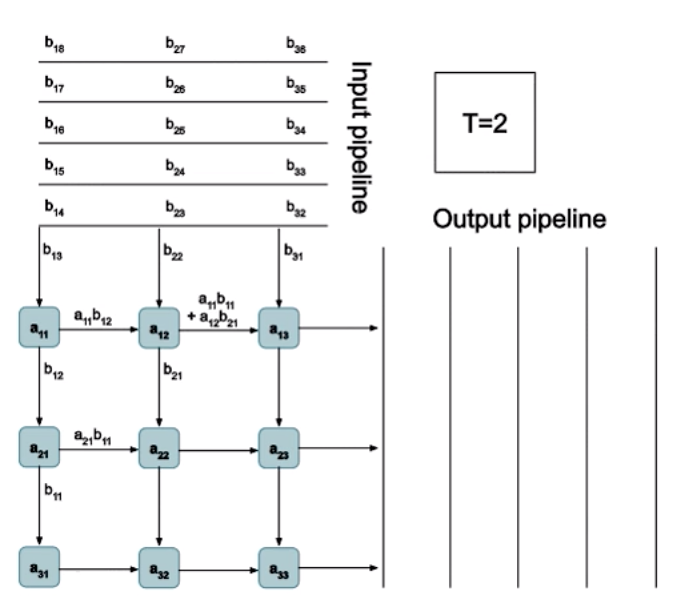
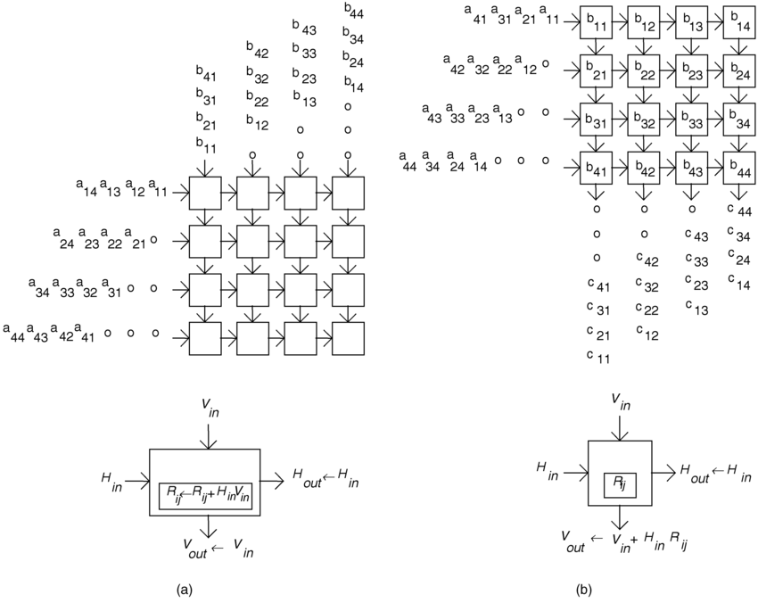

Various Chisel things for DNNs and Tensor Networks.

# 3rd party requirements

## hardfloat

Clone this [berkeley-hardfloat-chisel3](https://github.com/sifive/berkeley-hardfloat-chisel3) to somewhere.
run `sbt publishLocal` (where you cloned).
Add `"edu.berkeley.cs" %% "hardfloat" % "1.3-SNAPSHOT"` to `build.sbt`

# im2col

# WS Systolic Array

# OS and WS Systolic Array

# LineBuffer

